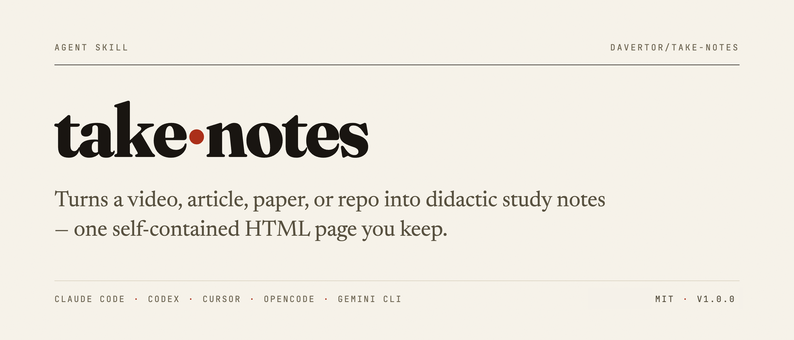
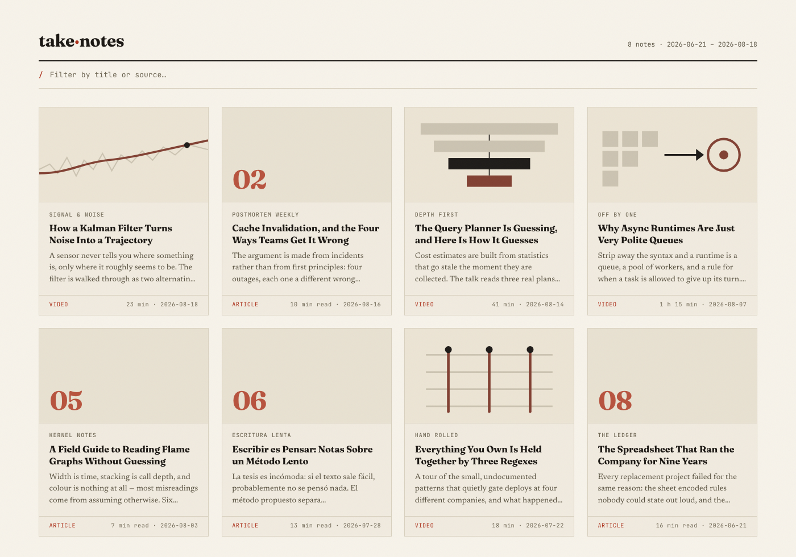
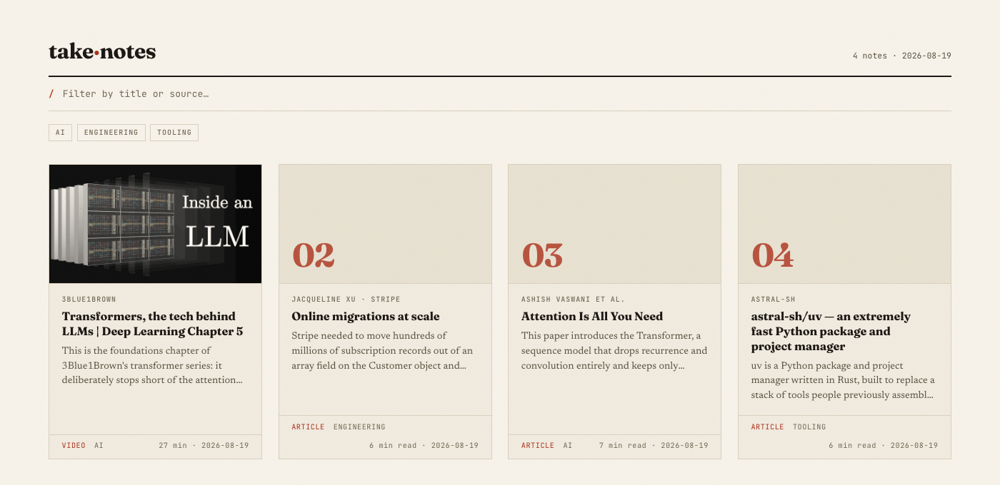

<p align="center">
  <picture>
    <source media="(prefers-color-scheme: dark)" srcset="docs/hero-dark.png">
    
  </picture>
</p>

<p align="center">
  
  <a href="LICENSE"></a>
  
  
</p>

**Notes you can actually learn from — not a transcript dump, not a one-paragraph summary.**

Point it at a video, an article, a paper, or a repo. You get a self-contained
HTML page — executive summary, the one takeaway, key points, and a timestamped
or sectioned outline — written to `~/take-notes/html_reports/` and opened in
your browser. They pile up into a browsable archive you own, on your disk, in
plain HTML that will still open in ten years.

<table>

<tr>

<td align="center" width="50%">

<a href="docs/video-note.png">

</a>

<br><sub><b>Video note</b> — poster, timestamped index, scroll-spy</sub>

</td>

<td align="center" width="50%">

<a href="docs/article-note.png">

</a>

<br><sub><b>Article note</b> — byline kicker, numbered index, scroll-spy</sub>

</td>

</tr>

</table>

<p align="center">
  <a href="#sources">Sources</a> ·
  <a href="#how-to-use">How to use</a> ·
  <a href="#focus">Focus</a> ·
  <a href="#gallery">Gallery</a> ·
  <a href="#tags">Tags</a> ·
  <a href="#export">Export</a> ·
  <a href="#install">Install</a> ·
  <a href="#credits">Credits</a>
</p>

---

## Why I built it

I kept watching hour-long videos and reading long posts, feeling like I'd
learned something, and then having nothing to show for it a week later. The
summaries I could get were either a wall of transcript or three bland
sentences — both useless for actually remembering anything.

So the rule this skill follows is: **explain, don't compress.** A bullet only
someone who already watched the video would understand has failed. Order things
by what has to be understood first, not by when they were said. Say what the
source left unanswered. And keep every note as one HTML file on my own disk,
because notes that live in someone else's product stop being yours eventually.

## Sources

| | |
|---|---|
| **YouTube** | any video URL, including the many non-YouTube sites yt-dlp supports |
| **Local media** | video or audio already on disk |
| **Web articles** | blog posts, docs pages, news articles |
| **arXiv papers** | full text via arXiv's HTML rendering, not just the abstract |
| **GitHub repos** | an orientation note: what it does, how it's laid out, what to read first |

## How to use

Point it at a URL. That is the whole thing:

```sh
/take-notes https://www.youtube.com/watch?v=NiKtZgImBdY
/take-notes https://simonwillison.net/2025/Jan/11/phi-4-bug-fixes/
/take-notes https://arxiv.org/abs/2407.09141
/take-notes https://github.com/ggml-org/llama.cpp
```

It writes `~/take-notes/html_reports/YYYY-MM-DD-<slug>.html` and opens it.
Re-running on the same source the same day **updates** that note rather than
leaving a near-duplicate beside it.

It runs only when you ask. The skill never fires on a URL you merely mention in
conversation, in any tool it's installed in.

### Focus

Add a phrase after the URL and the run narrows to it:

```sh
/take-notes https://unsloth.ai/docs/basics/dynamic-3.0-ggufs "just the v3.0 methodology"
/take-notes https://youtu.be/… "only the part about retrieval"
```

Focus narrows two things at once: **what gets fetched** — only the sections in
scope are pulled in rather than the whole document, which is where the token
saving comes from, since the source text is by far the largest input in a run —
and **what the finished notes emphasise**. It pays on a docs page that stacks
several versions of itself, a paper where you want one section, or a two-hour
video where twenty minutes matter; a short single-topic post has nothing to
trim. Leave it off to cover a source in full.

### Gallery

Notes pile up. `scripts/gallery.py` reads whatever is in
`~/take-notes/html_reports/` and writes `~/take-notes/gallery.html` — a card
per note, newest first, poster for videos and a filing plate for articles,
with a filter box (`/` focuses it, `Esc` clears it). Then it opens it.

Under the filter bar is a chip per [tag](#tags) in use: click one to narrow the
grid to that tag, click it again to clear. Chip and text filter combine.

<p align="center">
<a href="docs/gallery.png"></a>
<br><sub><b>The gallery</b> — the four notes in <a href="docs/examples"><code>docs/examples/</code></a>, every one of them real output. Clone the repo and open any of them to see a note in full.</sub>
</p>

```sh
uv run ~/.claude/skills/take-notes/scripts/gallery.py   # or your checkout path
```

Worth an alias, since you'll run it more than once:

```sh
alias notes='uv run ~/.claude/skills/take-notes/scripts/gallery.py'
```

It's a **plain script, not a skill** — building an index of files on disk needs
no model in the loop, so no agent is involved and nothing is spent. Re-run it
after taking notes; it rebuilds from scratch every time, so a note you delete
by hand simply stops appearing.

Flags: `--no-open`, `--notes-dir`, `--out`, `--lang en|es` (defaults to the
`language` in `~/take-notes/config.json`).

### Language

Optional — notes are written in **English** unless you say otherwise.

```jsonc
// ~/take-notes/config.json
{ "language": "es" }   // "en" (default) | "es" | "ask"
```

`"ask"` restores the per-run prompt, offering the source's own language first.

Override it for a single run with `--lang`, which beats the config — including
`"ask"`, since an explicit flag is not a question:

```sh
/take-notes https://youtu.be/… --lang en
```

Precedence is `--lang` → a language named in words ("…in English") → config →
English. A missing or malformed config falls back to English rather than
failing, and an unsupported `--lang` is reported rather than silently applied.
When the source's language differs from the one used, the skill says so, so a
Spanish video never quietly becomes English notes without a word.

### Tags

Every note is filed under one **primary tag**, plus any extras that apply. The
vocabulary lives beside `language` in the same config, and it is **closed**:
the skill picks from your list and never invents a tag, so the taxonomy stays
yours rather than whatever the model felt like that day.

```jsonc
// ~/take-notes/config.json
{ "language": "es", "tags": ["Unknown", "AI", "Investing", "Engineering"] }
```

Nothing fits — or no vocabulary is set — and the note lands on `Unknown`,
silently. You are never prompted to invent a tag mid-run.

<p align="center">
<a href="docs/gallery-tags.png"></a>
<br><sub><b>A tagged archive</b> — the primary tag sits beside the kind on each card, and every tag in use gets a chip. The notes are the four real examples; the tags on them are illustrative.</sub>
</p>

The full grammar, for reference:

```sh
/take-notes <url> [focus] [--lang en|es]
/take-notes --tags | --add-tag "AI" | --remove-tag "AI" | --retag
```

The second line manages tags instead of writing a note. Edit the list from the
skill, or from the CLI when you're already in a terminal:

```sh
/take-notes --tags                  # list it
/take-notes --add-tag "AI"          # add, report, write no note
/take-notes --remove-tag "AI"       # remove

uv run skills/take-notes/scripts/tags.py --add AI --add Investing
uv run skills/take-notes/scripts/tags.py --remove Investing
```

Both edit the same file and leave `language` untouched. `Unknown` is the
fallback the skill needs, so it can't be removed.

Set the vocabulary up after you'd already taken notes? `/take-notes --retag`
re-files the notes on disk against it, no source refetched and no prose
rewritten — it edits the tag row and nothing else:

```sh
/take-notes --retag
```

It reads each note's title and opening, picks from your vocabulary — never
outside it — and leaves anything that fits nothing on `Unknown`. Notes already
carrying a tag you chose are left alone. The underlying script is usable on its
own when you want to file one note by hand:

```sh
uv run skills/take-notes/scripts/retag.py --list                  # notes + current tags, as JSON
uv run skills/take-notes/scripts/retag.py --set NOTE.html --tag AI --tag Engineering
```

Rebuild the gallery afterwards so the chips match. Changing a single note's tag
also still works the old way: re-run `/take-notes` on its source — same day,
same file, new tag.

### Export

Notes are yours, so they leave cleanly. Both exporters read the rendered notes;
neither needs an agent or costs tokens.

```sh
uv run skills/take-notes/scripts/export.py --format md     # → ~/take-notes/markdown/
uv run skills/take-notes/scripts/export.py --format anki   # → ~/take-notes/take-notes.txt
```

- **`md`** — one Markdown file per note with YAML frontmatter. Drop the folder
  into an Obsidian vault, or import it into Notion. Timestamp links survive as
  real Markdown links, and the note's tags land in the frontmatter `tags:` list,
  which is what Obsidian's tag pane reads.
- **`anki`** — a tab-separated deck file. Cards come from *Key points* (claim →
  detail), *Concepts* (term → definition), and the one takeaway. The note's tags
  join the card kind in the tags column, so a deck filters by topic too. Import
  with **File → Import** and leave *Allow HTML in fields* on.

## Install

Works in **any [Agent Skills](https://agentskills.io)-compatible tool** — Claude
Code, Codex, Cursor, OpenCode, Gemini CLI, and any other host that reads the
same standard `SKILL.md` — no per-tool variants to maintain. Every script is
stdlib-only Python run through `uv`; there is nothing to `pip install`.

**Claude Code** (auto-updates via the marketplace):

```text
/plugin marketplace add davertor/take-notes
/plugin install take-notes@take-notes
```

That is the one to use if you have Claude Code — it is the only route that
auto-updates. The two options below are for everything else, or for editing the
skill yourself. Neither auto-updates; re-run it (or `git pull`) for the latest.

### Option A — clone + symlink, for tinkering

```sh
git clone https://github.com/davertor/take-notes
cd take-notes
./link-skill.sh              # every tool
AGENT=claude ./link-skill.sh # one tool only
```

[`link-skill.sh`](link-skill.sh) symlinks `skills/take-notes` into each
tool's skills directory (`claude`, `codex`, `cursor`, `opencode`, `gemini`,
`agents`). Idempotent, and replaces anything already occupying a target. A
real checkout — edit `skills/take-notes/` directly, or `git pull` for
upstream changes.

### Option B — the skills CLI

**Codex, Cursor, OpenCode, Gemini CLI**, or any other [Agent Skills](https://agentskills.io) host:

```sh
npx skills add davertor/take-notes -g                  # install for your user
npx skills add davertor/take-notes -g -a claude-code   # one agent only
```

**Pass `-g`** — without it, `add` installs project-level into the current
folder instead of your user directories. Update with `npx skills update take-notes`.

### Prerequisites


|                                      |                                                                                               |
| ------------------------------------ | --------------------------------------------------------------------------------------------- |
| [**uv**](https://docs.astral.sh/uv/) | runs the scripts; provisions its own Python, no separate install                              |
| **yt-dlp + ffmpeg**                  | video sources only — `scripts/setup.py` installs them via Homebrew on macOS                   |
| **Whisper API key**                  | optional, only for videos without captions — Groq or OpenAI, read from `~/.config/watch/.env` |


Web articles need none of the above — that path uses the agent's fetch tool.

Both install paths land on the same `/take-notes` — neither namespaces nor
renames it.

## Credits

Issues and pull requests are welcome — **[CONTRIBUTING.md](CONTRIBUTING.md)**
has the setup, the self-checks, and the four constraints that are easy to trip
over. The most useful issue you can open is a source it handled badly, with the
URL. Released changes are logged in [CHANGELOG.md](CHANGELOG.md).

- [bradautomates/claude-video](https://github.com/bradautomates/claude-video) by Bradley Bonanno (MIT).

## Star this repo

If a note from this saved you rewatching an hour of video to find the one thing
you actually needed, a star costs you nothing and is how the next person finds
it. ⭐
