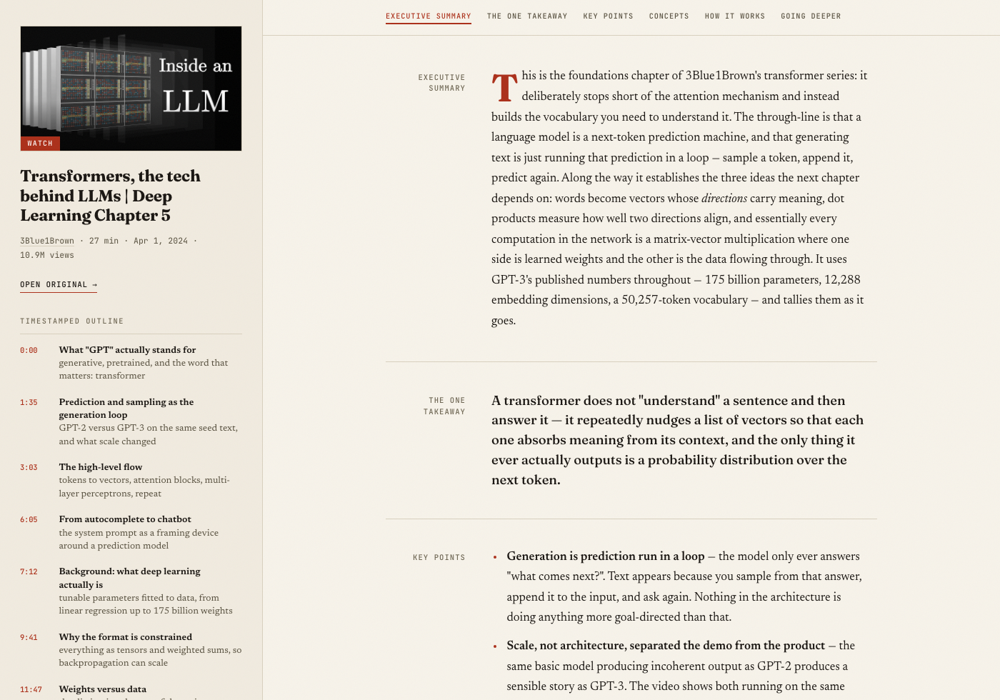
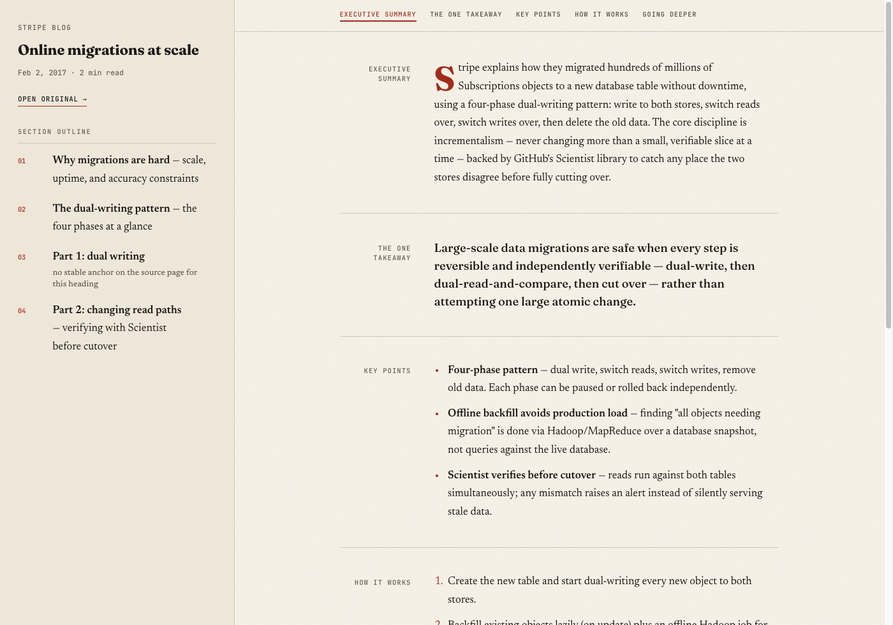

# take-notes

Turns a **YouTube video or web article** into didactic study notes — executive
summary, the one takeaway, key points, a timestamped or sectioned outline — as
a self-contained HTML page under `~/take-notes/html_reports/`, opened in the
browser.

Works in **Claude Code, Codex, Cursor, OpenCode, and Gemini CLI** — one
`SKILL.md`, no per-tool variants.

<table>
<tr>
<td align="center" width="50%">
<a href="docs/video-note.png"></a>
<br><sub><b>Video note</b> — poster, timestamped index, scroll-spy</sub>
</td>
<td align="center" width="50%">
<a href="docs/article-note.png"></a>
<br><sub><b>Article note</b> — byline kicker, numbered index, scroll-spy</sub>
</td>
</tr>
</table>

Click either thumbnail for the full-size page. Both real output — the skill
run end to end on an actual video and an actual blog post, not mockups.

## Install

Two ways in, two philosophies. **The skills CLI** links the skill into
whatever agent directories you have — quick, and every tool gets it in one
shot. **Clone + symlink** gives you a real git checkout instead, so you can
edit the note-writing standard or the templates directly. Neither auto-updates
in the background — pick whichever fits how you want to receive changes, then
re-run it (or `git pull`) when you want the latest.

### The skills CLI

```sh
npx skills add davertor/take-notes -g              # install for your user
npx skills add davertor/take-notes -l              # preview first
npx skills add davertor/take-notes -g -a claude-code   # one agent only
```

**Pass `-g`.** Without it, `add` installs *project-level* into the current
folder instead of your user directories. Update with `npx skills update
take-notes` — it does not happen on its own.

### Clone + symlink, for tinkering

```sh
git clone https://github.com/davertor/take-notes ~/take-notes-src
ln -s ~/take-notes-src/skills/take-notes ~/.claude/skills/take-notes
```

Other valid targets: `~/.codex/skills/`, `~/.cursor/skills/`,
`~/.config/opencode/skills/`, `~/.gemini/skills/`, `~/.agents/skills/`. It's a
real checkout — edit anything under `skills/take-notes/` directly, then `git
pull` in `~/take-notes-src` for upstream changes.

### What you'll need

| | |
|---|---|
| **[uv](https://docs.astral.sh/uv/)** | runs the scripts; provisions its own Python, no separate install |
| **yt-dlp + ffmpeg** | video sources only — `scripts/setup.py` installs them via Homebrew on macOS |
| **Whisper API key** | optional, only for videos without captions — Groq or OpenAI, read from `~/.config/watch/.env` |

Web articles need none of the above — that path uses the agent's fetch tool.

Invoke with `/take-notes <url> [focus] [--lang en|es]`. The optional focus
narrows what the notes emphasise (e.g. `"just the API design part"`), and
`--lang` overrides the configured language for one run. Both install paths
land on the same `/take-notes` — neither namespaces or renames it.

## Config

Optional — notes are written in **English** unless you say otherwise.

```jsonc
// ~/take-notes/config.json
{ "language": "es" }   // "en" (default) | "es" | "ask"
```

`"ask"` restores the per-run prompt, offering the source's own language first.

Override it for a single run with `--lang`, which beats the config — including
`"ask"`, since an explicit flag is not a question:

```sh
/take-notes https://youtu.be/… --lang en
```

Precedence is `--lang` → a language named in words ("…in English") → config →
English. A missing or malformed config falls back to English rather than
failing, and an unsupported `--lang` is reported rather than silently applied.
When the source's language differs from the one used, the skill says so, so a
Spanish video never quietly becomes English notes without a word.

## Layout

Follows the [Agent Skills](https://agentskills.io/specification) layout —
`scripts/` for executable code, `references/` for docs loaded on demand,
`assets/` for templates.

```
skills/take-notes/
  SKILL.md             route by source, and the note-writing standard
  references/
    youtube.md          captions via yt-dlp, Whisper fallback
    web.md                fetch + extract article text
  scripts/
    transcript.py         transcript entry point (captions -> Whisper)
    render.py              wraps note HTML in a styled standalone page
    ...                    transcript helpers (see Credits)
  assets/
    template.html         the two-pane video note layout
    article-template.html the two-pane article note layout
  agents/
    openai.yaml           Codex: never auto-invoke, require an explicit $skill
```

`agents/` is outside the spec, which permits extra directories. It holds the
Codex counterpart to `disable-model-invocation: true` in `SKILL.md`: together
they keep the skill **user-invoked only**, so it never fires on a URL you merely
mention. Both must change together, or one tool will start auto-triggering.

Both reference guides hand back the same five fields (title, byline, span,
canonical URL, body); `SKILL.md` holds the only copy of the note-writing
standard. Re-running on the same source the same day updates that note
instead of duplicating it.

## Credits

`scripts/config.py`, `download.py`, `transcribe.py`, `whisper.py` and
`setup.py` originated from
[bradautomates/claude-video](https://github.com/bradautomates/claude-video) by
Bradley Bonanno (MIT). They're maintained independently here now, not kept in
sync with upstream.

MIT licensed. See [LICENSE](LICENSE).
